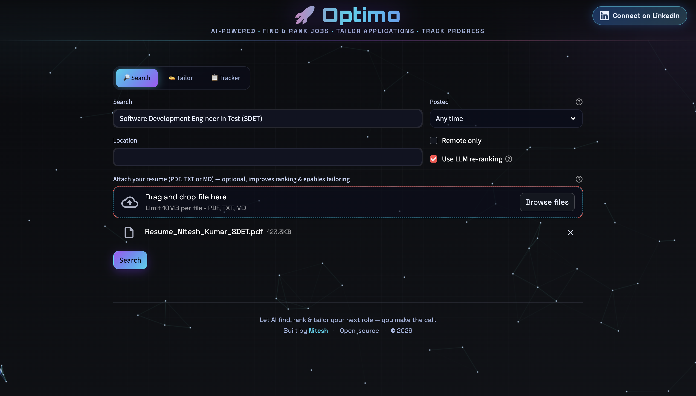

# 🚀 Optimo

_An open-source, AI-powered job search agent._



Optimo pulls real job listings from multiple sources, ranks them against your
resume with an AI fit score + reasons, helps you tailor each application, and
tracks your pipeline — all locally, with you in control.

Two ways to use it: a **Streamlit web UI** and a **CLI**. Both share the same core.

---

## What it does

| Capability | What you get |
|---|---|
| 🔎 **Find & rank** | Jobs from **LinkedIn, Indeed, Glassdoor** (JSearch), **Instahyre, Naukri** (web search), **RemoteOK**, Adzuna, and Greenhouse — de-duplicated across sources and ranked by fit with a score + ✅ reasons / ⚠️ concerns. |
| ✍️ **Tailor** | Drafts a grounded cover letter and rewrites resume bullets for a specific role — using only what's actually on your resume. |
| 📋 **Track** | Saves applications to a local SQLite database, moves them through statuses, exports to CSV. |

It runs out of the box with **zero keys** (RemoteOK + keyword ranking). Every key that
unlocks more is **free** and optional — add them one at a time.

---

## 1. Install & run

Requires **Python 3.10+**.

```bash
git clone https://github.com/niteshk38/Optimo.git
cd Optimo
python -m venv .venv && source .venv/bin/activate   # Windows: .venv\Scripts\activate
pip install -r requirements.txt
cp .env.example .env        # your API keys go here (gitignored — never committed)
```

Run the web UI:
```bash
streamlit run app/streamlit_app.py
```
…or the CLI:
```bash
python cli.py search --query "software engineer" --location India
```

That already works (RemoteOK jobs, keyword ranking). To add **AI** and **more job
sources**, fill in the free keys below.

---

## 2. Turn on AI (pick ONE — both free)

AI adds the fit **score with reasons**, resume understanding, and cover-letter / bullet
tailoring. Without it you still get keyword ranking.

### Option A — Groq (free hosted API, no GPU, recommended)
Fast, and gives clearly better reasoning than a small local model. No credit card.
1. Sign up at **https://console.groq.com** → **API Keys** → **Create API Key** (starts `gsk_…`).
2. Put in `.env`:
   ```env
   LLM_BASE_URL=https://api.groq.com/openai/v1
   LLM_MODEL=llama-3.3-70b-versatile
   LLM_API_KEY=gsk_your_key
   ```
   (`70b-versatile` = best reasoning; `llama-3.1-8b-instant` = faster. Model names change —
   see https://console.groq.com/docs/models.)

### Option B — Ollama (local, free, private, offline)
Best if you'd rather your resume never leave your machine. Needs a capable computer.
1. Install **https://ollama.com**, then: `ollama pull llama3.1`
2. Leave the `LLM_*` vars in `.env` **blank** — Ollama at `http://localhost:11434` is the default.

> Any OpenAI-compatible provider (OpenAI, Together, etc.) works — just set the three `LLM_*` values.

**Restart the app after editing `.env`** — keys are read once at startup.

---

## 3. Turn on job sources (all free, all optional)

Enable/tune them in `config.yaml`. Each source **disables itself silently** if its key
is missing, so add only the ones you want.

| Source | Gets you | Add to `.env` | Free tier |
|--------|----------|---------------|-----------|
| **remoteok** | Remote tech jobs | — (no key) | unlimited |
| **jsearch** | **LinkedIn · Indeed · Glassdoor** (full descriptions) | `RAPIDAPI_KEY` | ~200 searches/mo |
| **websearch** | **Instahyre · LinkedIn · Naukri** (links) | `SERPER_API_KEY` | ~2,500 searches |
| **adzuna** | Multi-country listings | `ADZUNA_APP_ID` + `ADZUNA_APP_KEY` | free |
| **greenhouse** | Specific company boards | — (list boards in config) | free |

**jsearch (LinkedIn/Indeed) — the main source:**
1. Sign up at https://rapidapi.com → open **JSearch**
   (https://rapidapi.com/letscrape-6bRBa3QguO5/api/jsearch).
2. **Pricing** → **Subscribe** to **Basic ($0/mo)**. *(You must subscribe — copying the key isn't enough.)*
3. Copy the `X-RapidAPI-Key` → `.env` as `RAPIDAPI_KEY=…`

**websearch (Instahyre/Naukri) — via [Serper](https://serper.dev):**
1. Sign up at https://serper.dev (Google login; free tier).
2. Dashboard → **API Key** → copy → `.env` as `SERPER_API_KEY=…`

> Deeper config, an alternative Google Custom Search backend, and troubleshooting are in
> **[SETUP.md](SETUP.md)**.

---

## 4. Usage

### Web UI
```bash
streamlit run app/streamlit_app.py
```
Attach your resume, search, filter by portal / freshness / salary, then tailor and save jobs.

### CLI
```bash
python cli.py search --query "software engineer" --location India --resume resume.txt
python cli.py save   --rank 1
python cli.py tailor --rank 1 --kind cover
python cli.py track  list
python cli.py track  status --job-id <id> --to applied
python cli.py track  export --out applications.csv
```
No model running? Add `--no-llm` to `search` for keyword-only ranking.

---

## 5. How ranking works

Every job gets a fast **keyword-overlap** score against your skills/preferences (works with
no model at all). When an LLM is reachable, the top `rerank_k` candidates are **re-scored
with reasoning** (fit score + why it fits + honest concerns), and the two are blended:

```
final = llm_weight × AI_score + (1 − llm_weight) × keyword_score   # defaults: 0.7 / 0.3
```

Tune `matcher.llm_weight` and `matcher.rerank_k` in `config.yaml`.

## Configuration

- **Secrets** → `.env` (gitignored). **Settings** → `config.yaml`.
- If `config.yaml` is absent, `config.example.yaml` is used, so the project runs out of the box.
- Full reference for every key and setting: **[SETUP.md](SETUP.md)**.

## Project layout

```
jobagent/
  config.py      # config.yaml + .env
  llm.py         # OpenAI-compatible client (Ollama / Groq / any)
  models.py      # Job, Profile, MatchResult, Application
  resume.py      # resume -> Profile (LLM, with a heuristic fallback)
  matcher.py     # keyword score + optional LLM re-rank
  tailor.py      # cover letters + resume bullets
  tracker.py     # SQLite tracking + CSV export
  pipeline.py    # orchestration shared by both UIs
  sources/       # remoteok, jsearch, websearch, adzuna, greenhouse (+ your own)
app/streamlit_app.py
cli.py
tests/
```

Adding a job source is a ~40-line file — see [CONTRIBUTING.md](CONTRIBUTING.md).

## A note on scope

Optimo **does not auto-apply** to jobs — you stay in control of what gets sent. Job data
comes only from legitimate, publicly documented APIs (JSearch aggregator, Serper web
search, RemoteOK, Adzuna, Greenhouse) — **never by scraping** sites whose terms forbid it.

## Contributing

PRs welcome — see [CONTRIBUTING.md](CONTRIBUTING.md). Please run `pytest` first.

## License

[MIT](LICENSE) — free to use, modify, and share.
